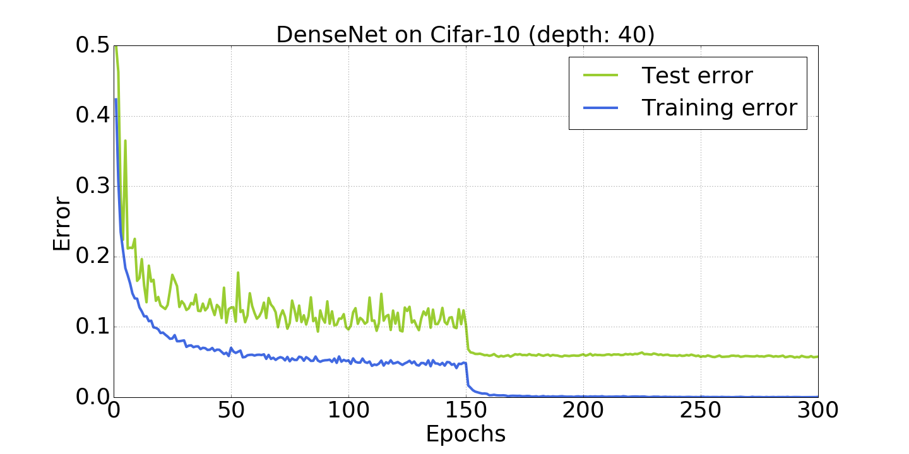
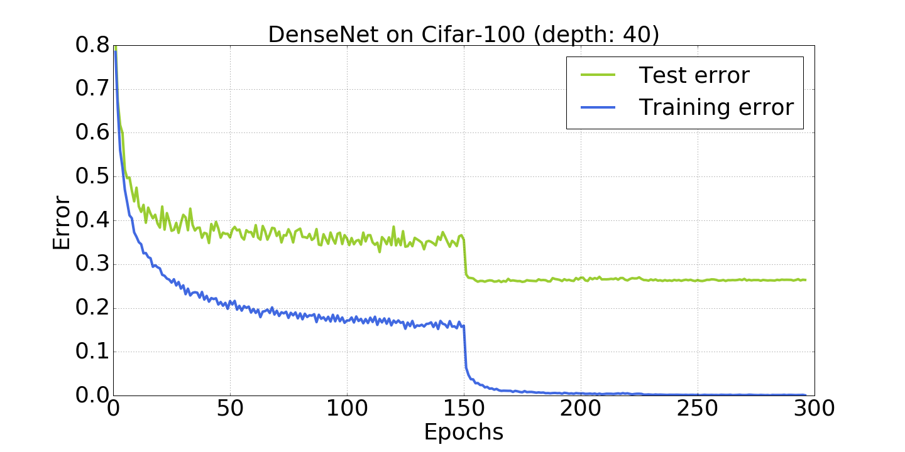

# DenseNet-tensorflow
This repository contains the tensorflow implementation for the paper [Densely Connected Convolutional Networks](http://arxiv.org/abs/1608.06993).

The code is developed based on Yuxin Wu's implementation of ResNet (https://github.com/ppwwyyxx/tensorpack/tree/master/examples/ResNet).

Citation:

     @inproceedings{huang2017densely,
          title={Densely connected convolutional networks},
          author={Huang, Gao and Liu, Zhuang and van der Maaten, Laurens and Weinberger, Kilian Q },
          booktitle={Proceedings of the IEEE Conference on Computer Vision and Pattern Recognition},
          year={2017}
      }

## Dependencies:

+ Python 2 or 3
+ TensorFlow >= 1.0
+ [Tensorpack] (https://github.com/ppwwyyxx/tensorpack)

## Train a DenseNet (L=40, k=12) on CIFAR-10+ using

```
python cifar10-densenet.py
```
In our experiment environment (cudnn v5.1, CUDA 7.5, one TITAN X GPU), the code runs with speed 5iters/s when batch size is set to be 64. The hyperparameters are identical to the original [torch implementation] (https://github.com/liuzhuang13/DenseNet).

## Training curves on CIFAR-10+ (~5.77% after 300 epochs)



## Training curves on CIFAR-100+ (~26.36% after 300 epochs)



## Differences compared to the original [torch implementation] (https://github.com/liuzhuang13/DenseNet)
+ Preprocessing is not channel-wise, instead we use mean and variances of images.
+ There is no momentum and weight decay applied on the batch normalization parameters (gamma and beta), whereas torch vertison uses both momentum and weight decay on those.

## Questions?

Please drop [me](http://www.cs.cornell.edu/~yli) a line if you have any questions!
